# 2.5Dキャラクター確認

原画1枚からの通常生成と、承認済み比較候補の確認ページです。左は変更しない原画、右は本体と共通の2.5Dレンダラーです。2026年9月7日、Chrome・1440×1050の確認画面で撮影しています。新旧の生成条件は各項目に明記し、画像をタップすると拡大表示できます。

これは実走・動作の確認用であり、ひより相当の全身可動や全キャラの最終品質合格を示すページではありません。口は現在の形で暫定承認され、追加造形調整を保留しています。

## むぎ：通常生成版の最新検証（全体品質は未合格）

2976×4175の原画、原寸832角の局所編集。補完版4・閉眼生成版3・隠れ顔マスク版3・耳版2で通常出力へ保存し、原画保持を検査しました。耳補修の髪所有を直し、前髪下の大きな矩形と過大な耳露出は改善しました。

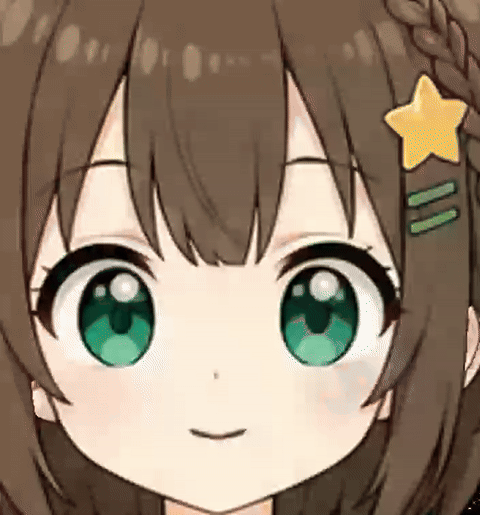

共通レンダラーの8秒の実録画から作った縮小GIFです。録画は134フレーム、実測約16.7 fps（要求20 fps）。GPU診断と並走したため単独描画性能ではありません。GIFは確認用であり、原寸素材や透過の品質証拠にはしません。

[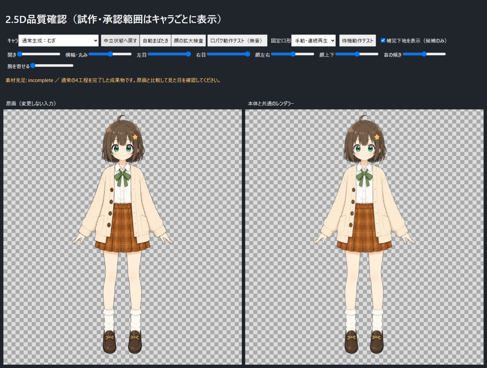](character-gallery-25d/mugi-hidden3/full.png)

| 中立 | 半閉眼 | 完全閉眼 |
|---|---|---|
| [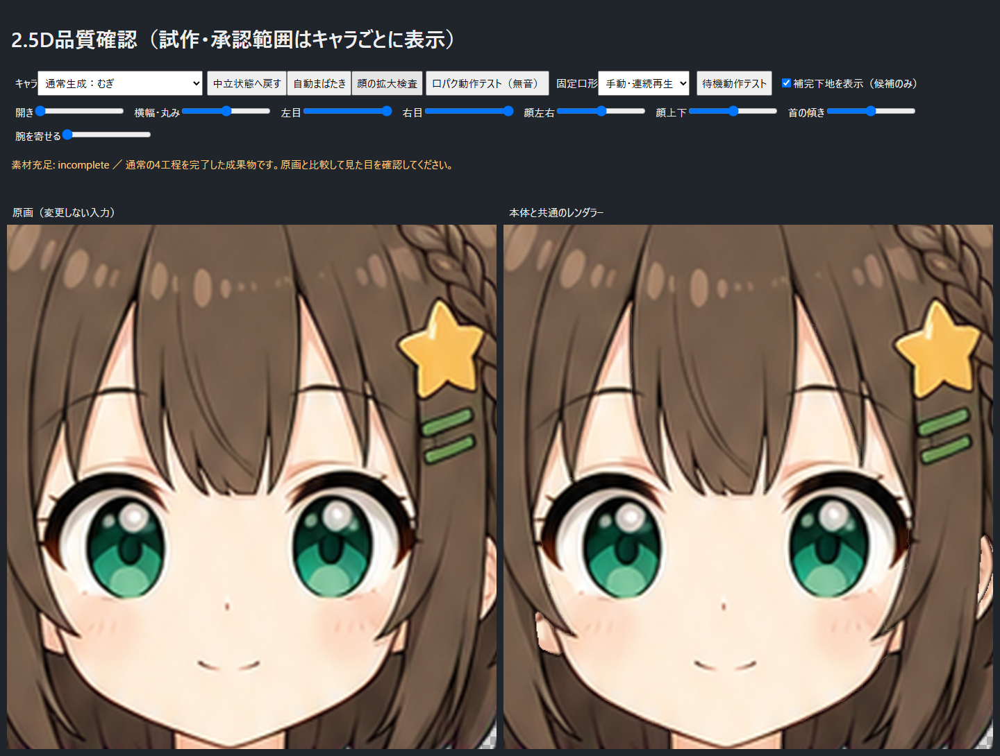](character-gallery-25d/mugi-hidden3/neutral.png) | [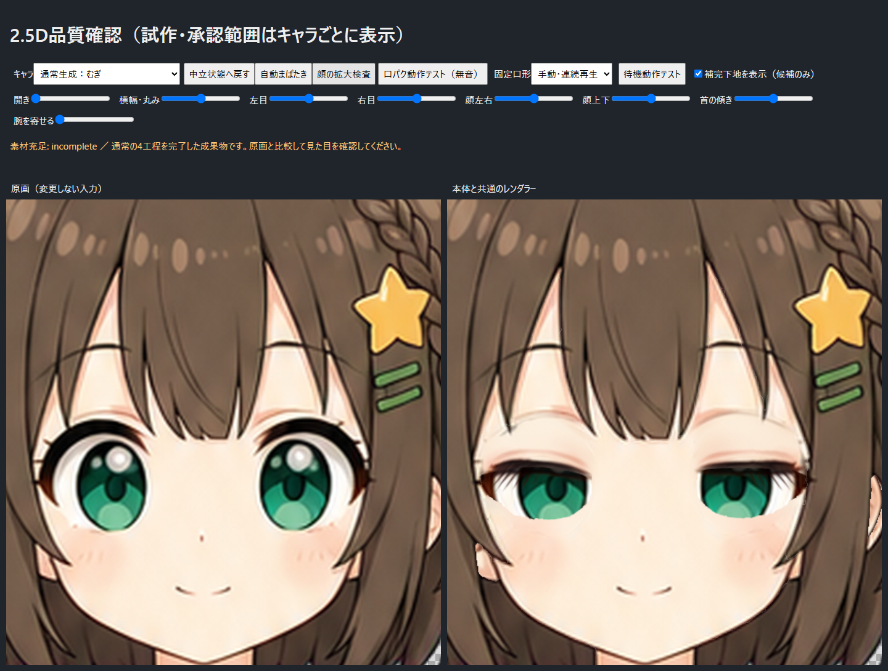](character-gallery-25d/mugi-hidden3/half.png) | [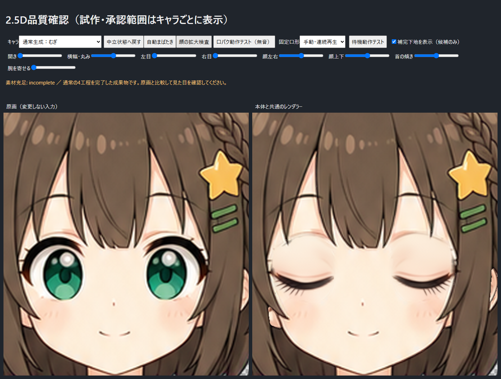](character-gallery-25d/mugi-hidden3/closed.png) |

[開口「あ」](character-gallery-25d/mugi-hidden3/mouth-a.png)・[小角度の顔向き](character-gallery-25d/mugi-hidden3/left.png)

**残る問題:** 半閉眼の下端の輪郭、動いたときの細い髪際、詳細な素材分割は未完成です。耳・閉眼を承認いただいた旧比較候補とは別物で、今回の通常生成版への品質承認を意味しません。口の造形は暫定承認された共通仕様のままです。

## むぎの動作比較（承認済みの旧候補）

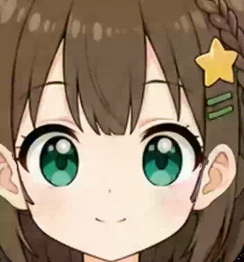

「むぎ・耳＋閉眼修正候補」の共通レンダラーを8秒録画したものです。口パクとまばたきは実描画で、静止画を別途並べたアニメーションではありません。現在再生成中の通常補完版とは別の、耳・閉眼の承認済み基準です。縮小GIFなので色数・透明背景・動きの滑らかさは実画面と異なり、原寸画質の合格根拠には使いません。Qwen生成と並走した録画の実測は約10.6 fpsで、単独描画の性能値ではありません。

## PicoAgent実写テスト

依頼対象の`photoreal-prototype`（ピンクのショートヘア、黒とピンクの衣装）を使用。別の女性素材ではありません。1024×1536の原画から同じ通常工程で生成し、局所閉眼は608×608の原寸領域を編集しています。原画SHAの一致を検査済みです。

[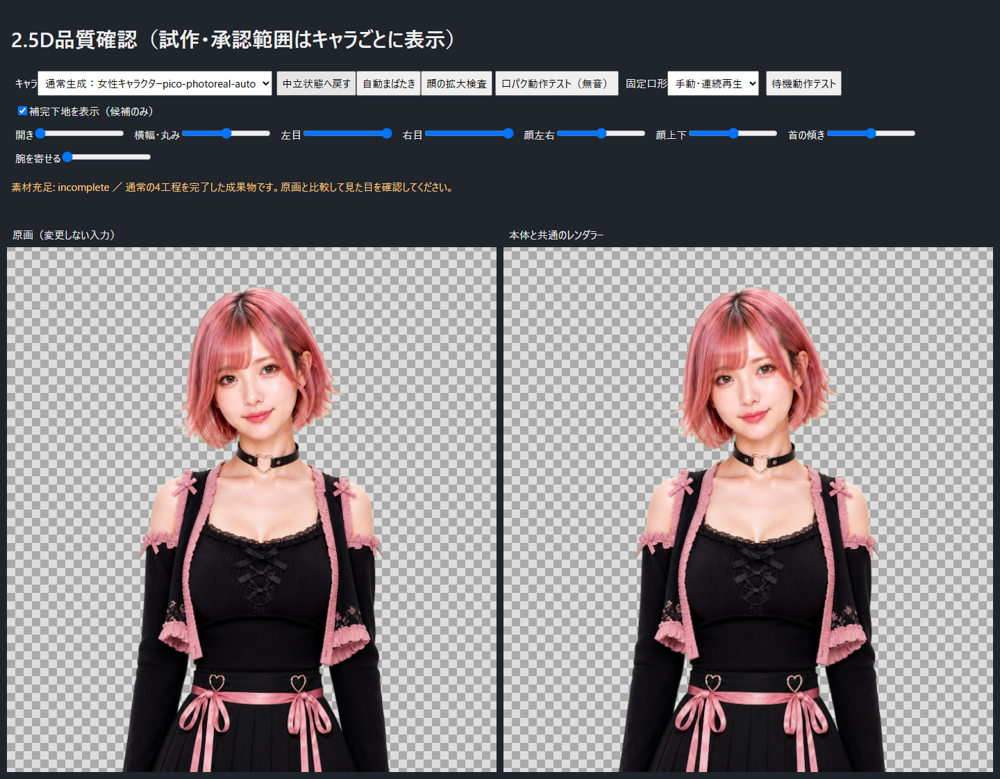](character-gallery-25d/pico-photo/full.png)

| 中立 | 半閉眼 | 完全閉眼 |
|---|---|---|
| [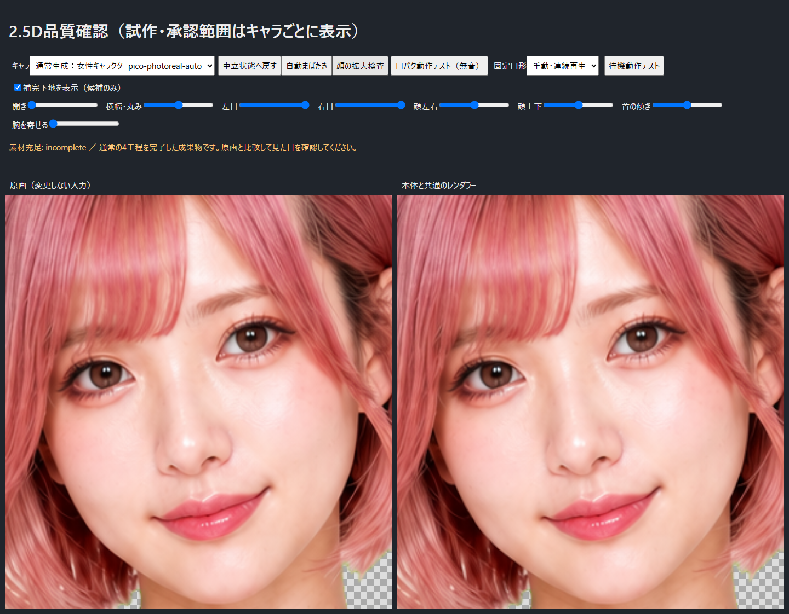](character-gallery-25d/pico-photo/neutral.png) | [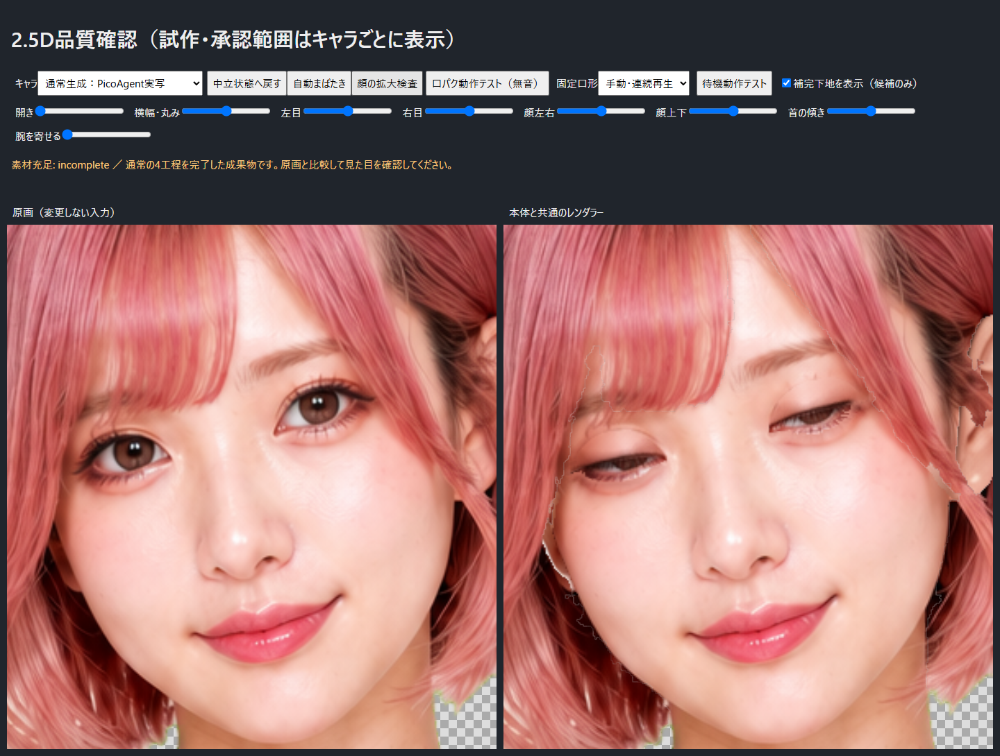](character-gallery-25d/pico-photo/half.png) | [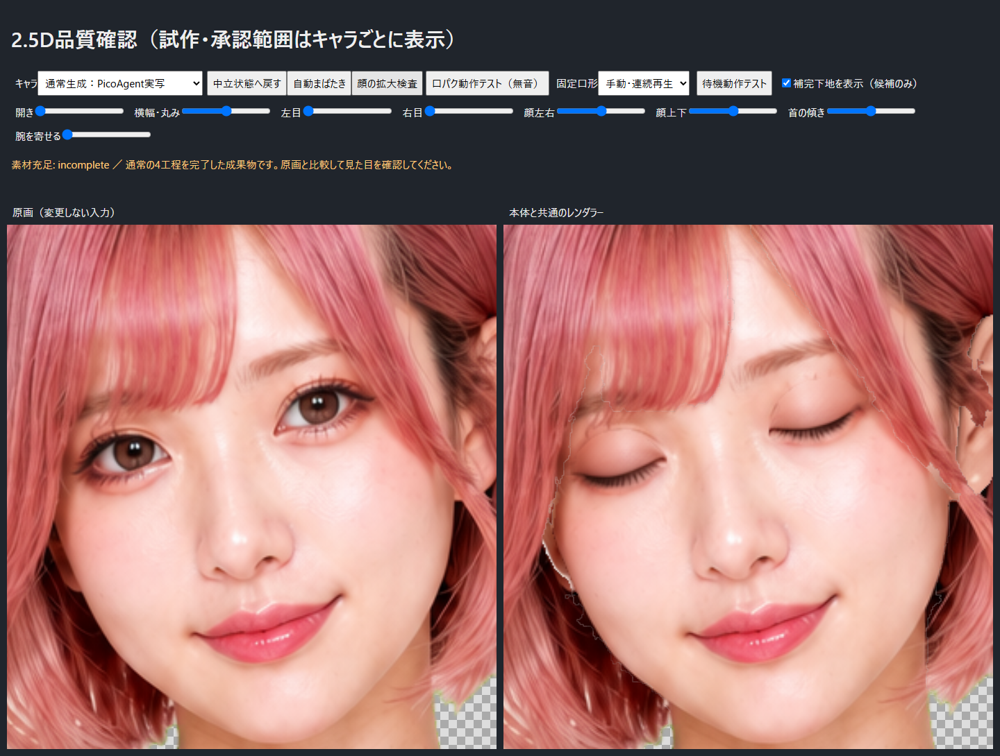](character-gallery-25d/pico-photo/closed.png) |

[開口「あ」](character-gallery-25d/pico-photo/mouth-a.png)・[小角度の顔向き](character-gallery-25d/pico-photo/left.png)

確認範囲: 通常4工程の完走、原画保持、中立・半閉眼・完全閉眼・開口・小角度表示。眉下の細い境界と、実写に対する口内のイラスト寄りの質感は残っています。素材充足表示の`incomplete`を完成品質の意味へ読み替えないでください。

## むぎ：旧・閉眼のみの通常生成（比較記録）

2976×4175の原画から、同じ4工程・同じ設定で生成しました。局所編集は原寸832×832です。通常生成の完走と、保存済み生成画像の再利用を確認しました。

| 中立 | 半閉眼 | 完全閉眼 |
|---|---|---|
| [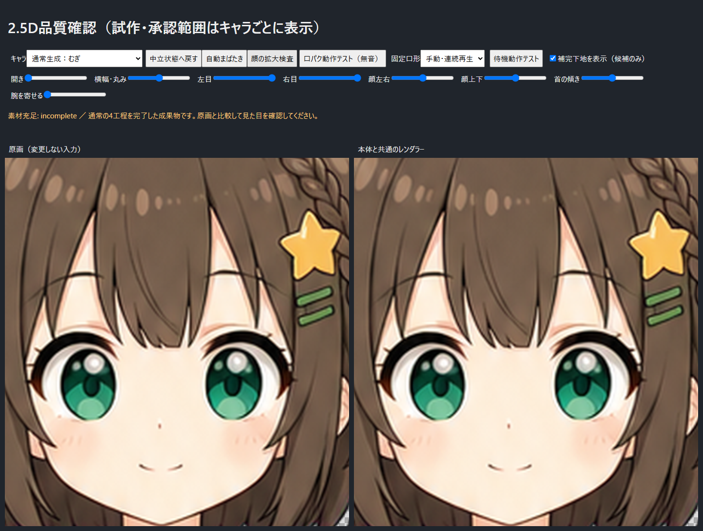](character-gallery-25d/mugi/neutral.png) | [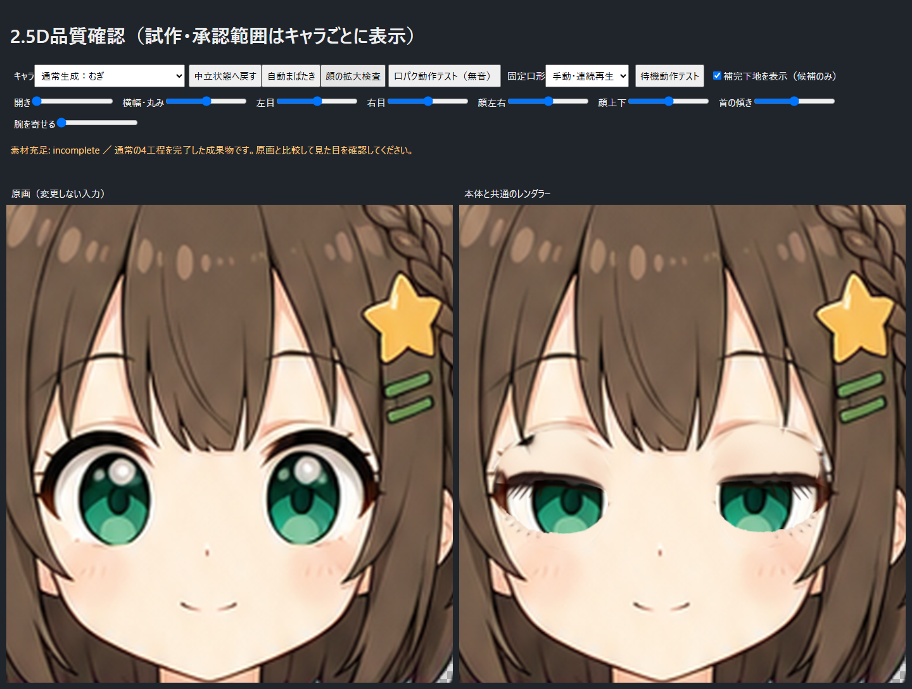](character-gallery-25d/mugi/half.png) |  |

[開口「あ」](character-gallery-25d/mugi/mouth-a.png)

**未合格:** 左目上の黒い残片と目周囲の境界が残っています。生成画像にも存在するため、抽出成功だけを合格扱いしません。耳輪郭の修正はこの通常出力にはまだ入っていません。利用者承認済みの旧「むぎ・耳＋閉眼修正候補」は別に保持しています。

## 女性A

1254×1254の原画から同じ4工程で完走しました。顔周辺は原寸256×256の領域を使い、画像全体を256へ縮小したものではありません。原画SHA一致を検査済みです。

[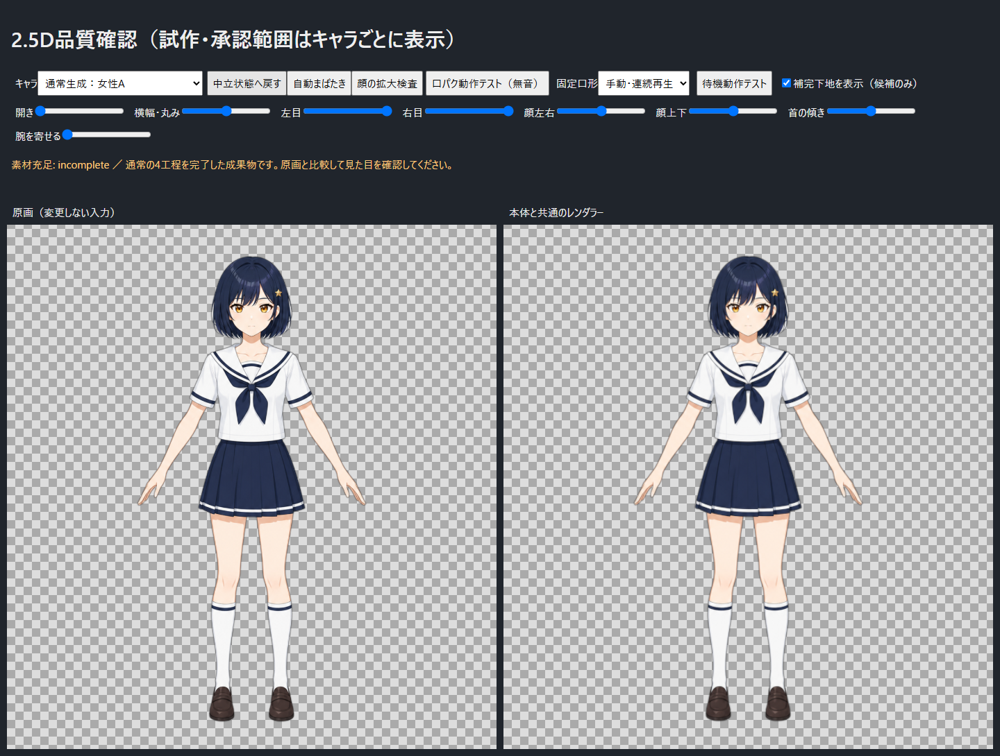](character-gallery-25d/female-a/full.png)

| 半閉眼 | 完全閉眼 |
|---|---|
| [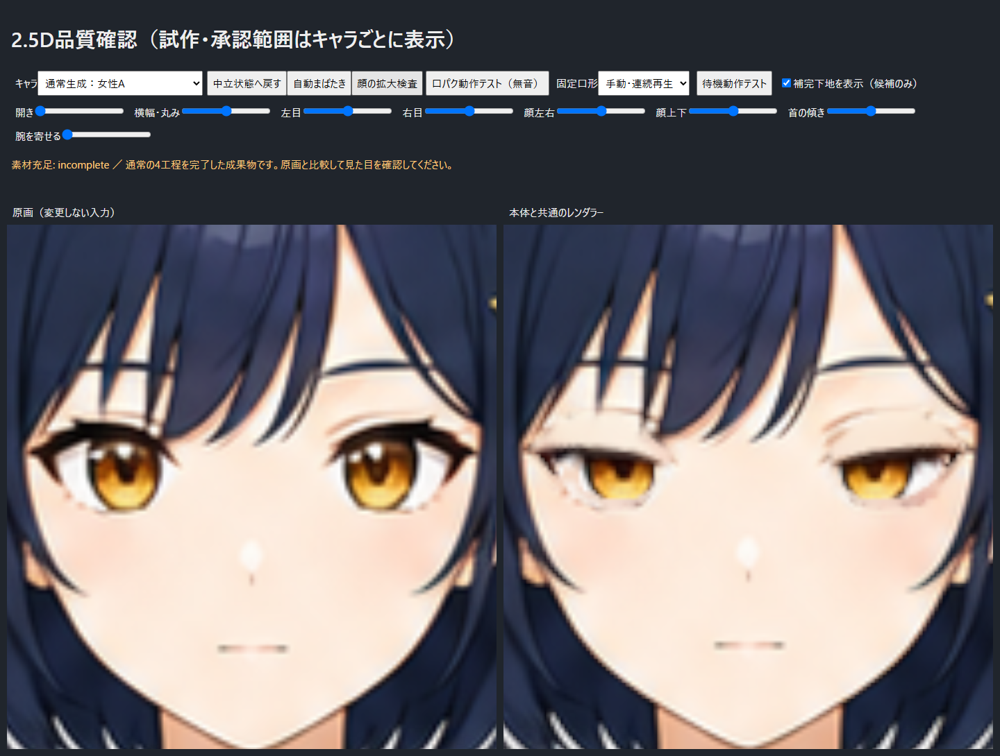](character-gallery-25d/female-a/half.png) | [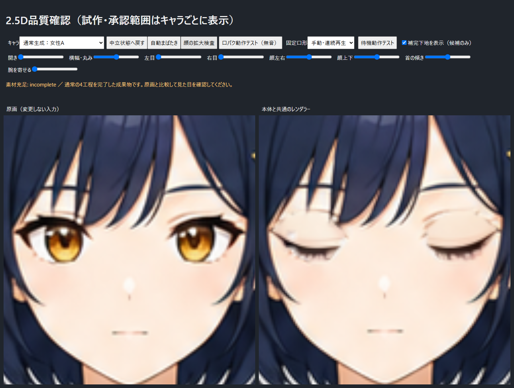](character-gallery-25d/female-a/closed.png) |

目の上下に細い境界・残片があるため最終品質は未合格です。顔を大きく表示した際の原画自体の解像感も確認できます。原画を補間拡大した素材へ置き換えてはいません。

## 動かして確認する

開発PCで確認サーバー起動中は、[キャラ選択付き確認画面](http://10.76.3.1:8791/ui/check.html)から切り替えられます。このリンクは同じネットワーク内だけで利用できます。上の画像はGitHubから閲覧でき、開発PCが停止していても参照できます。

「口パク動作テスト（無音）」と「自動まばたき」は別々に開始します。「固定口形」で閉口・母音を静止確認できます。

旧3Dの失敗比較は[過去の3Dギャラリー](LEGACY_3D_GALLERY.md)へ分離しました。現在の2.5Dの完成例ではありません。
