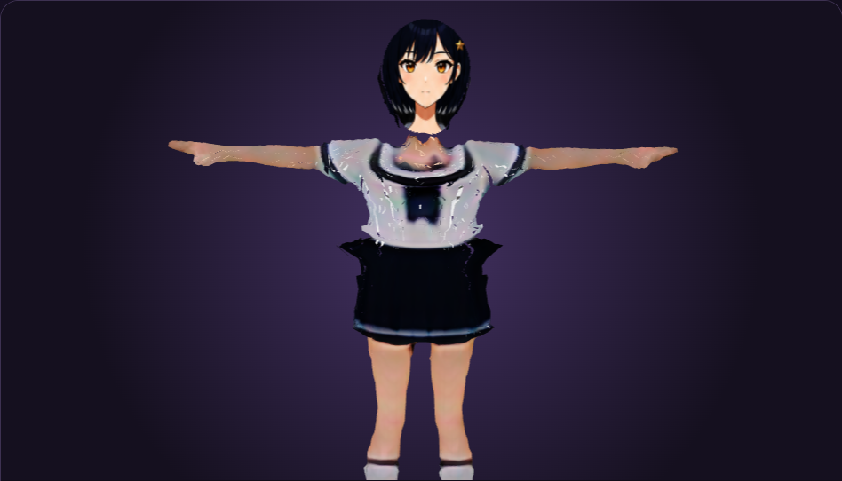
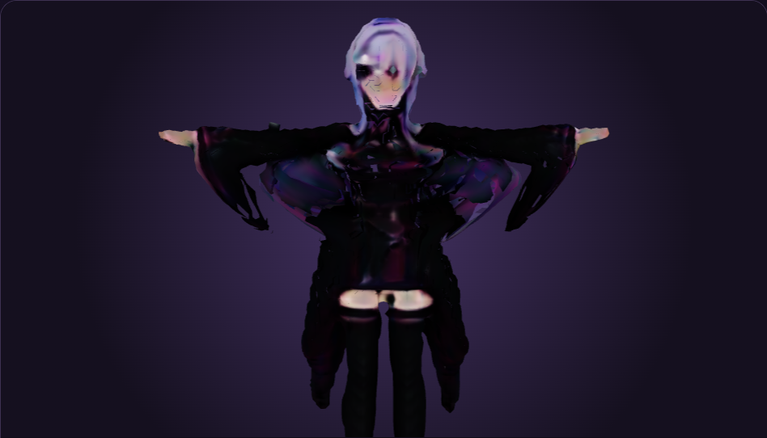
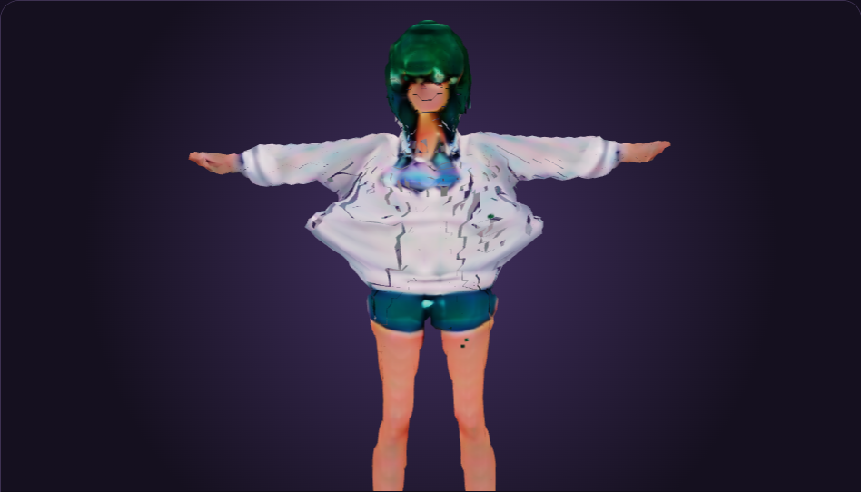
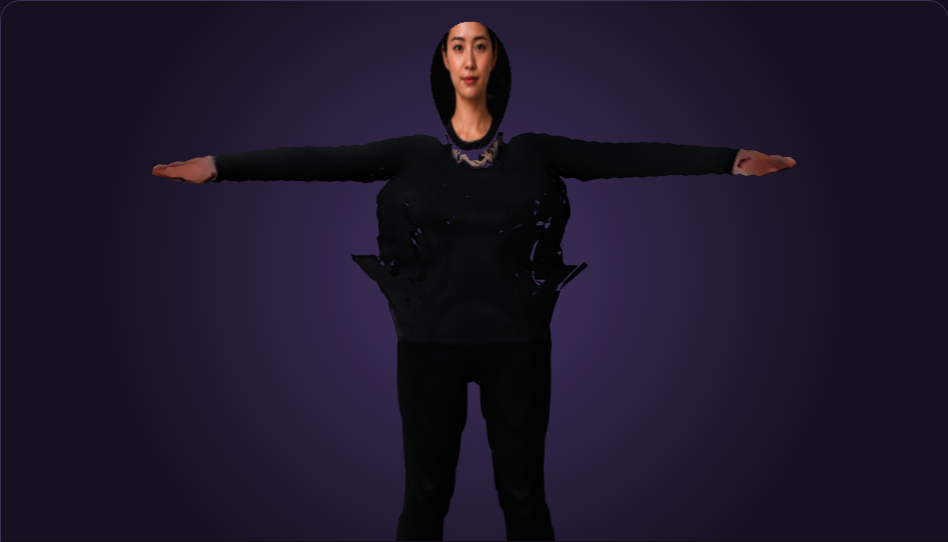

# 過去の3D試作ギャラリー（不採用方式）

これは2026年9月4日の旧3D比較です。現在の成果物は[2.5Dキャラクター確認](CHARACTER_GALLERY.md)を参照してください。以下の「現在」は撮影当時を指し、現在の採用方式・依頼対象ではありません。

スマートフォンから現在の全テストキャラクターを確認するための一覧です。画像をタップすると、実際のTauri WebView全体を表示します。

撮影条件は2026年9月4日時点の開発版、正面、Yaw 0度、笑顔、口閉じで統一しています。これは生成成功の証跡であり、配布品質の合格例ではありません。

## 女性キャラクターA

- 紺色ボブ、白い上衣、黒いスカート。
- 4体では最も人物形状を読み取りやすい一方、首・胴体・衣装の接続と腕の表面が粗いです。

## 女性キャラクターC

- 薄紫の長髪と装飾衣装。
- 髪、袖、胴体が大きく崩れ、顔も原画の造形を保持できていません。

## 女性キャラクターD

- 緑髪、大袖、短パン。
- 全身の輪郭は確認できますが、顔、首、衣装の継ぎ目と袖の形状が破綻しています。

## 実写テストキャラクター

- 実写の成人女性を入力した実験用キャラクターです。
- 顔の同一性は一部残るものの、肩、胴体、腰が崩れています。斜め表示では顔パッチが頭部から分離するため不合格です。

## 現時点の結論

4体とも生成パイプラインは完走しますが、現在の画像→3D経路は完成キャラクター品質に達していません。特に長髪・大袖・実写入力で崩れが大きく、方式の再決定が必要です。
