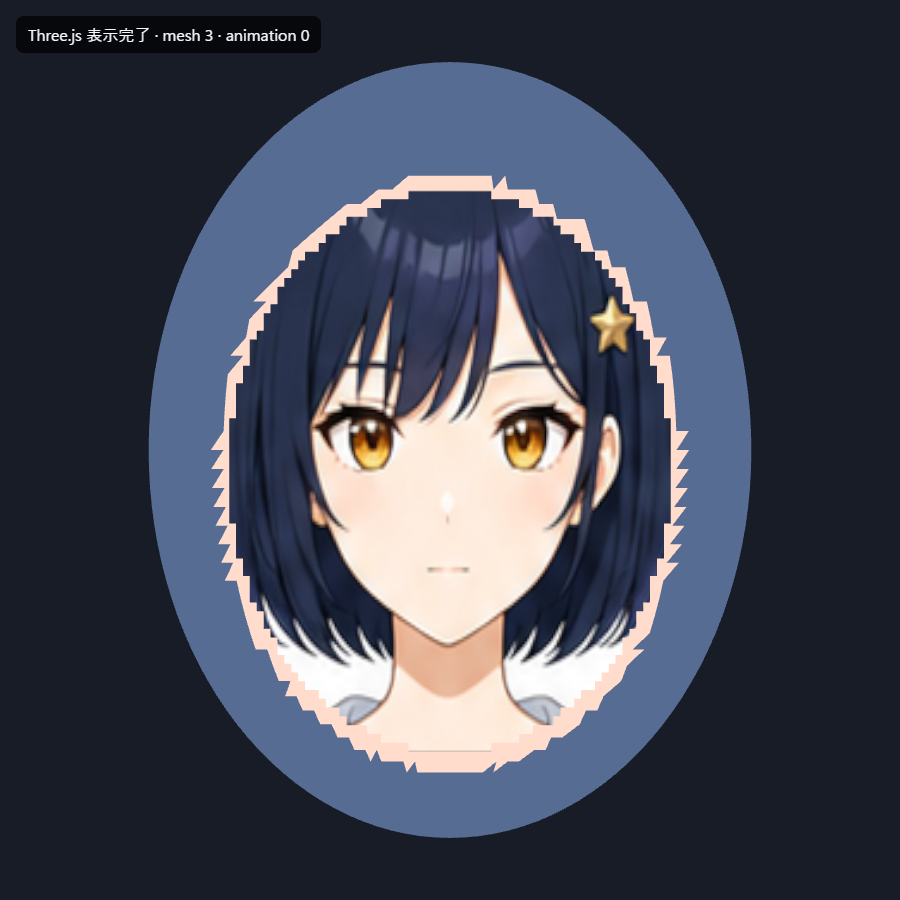
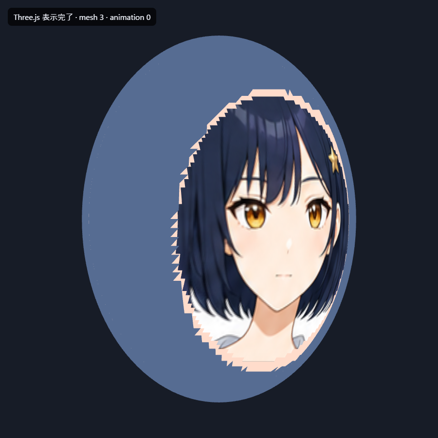
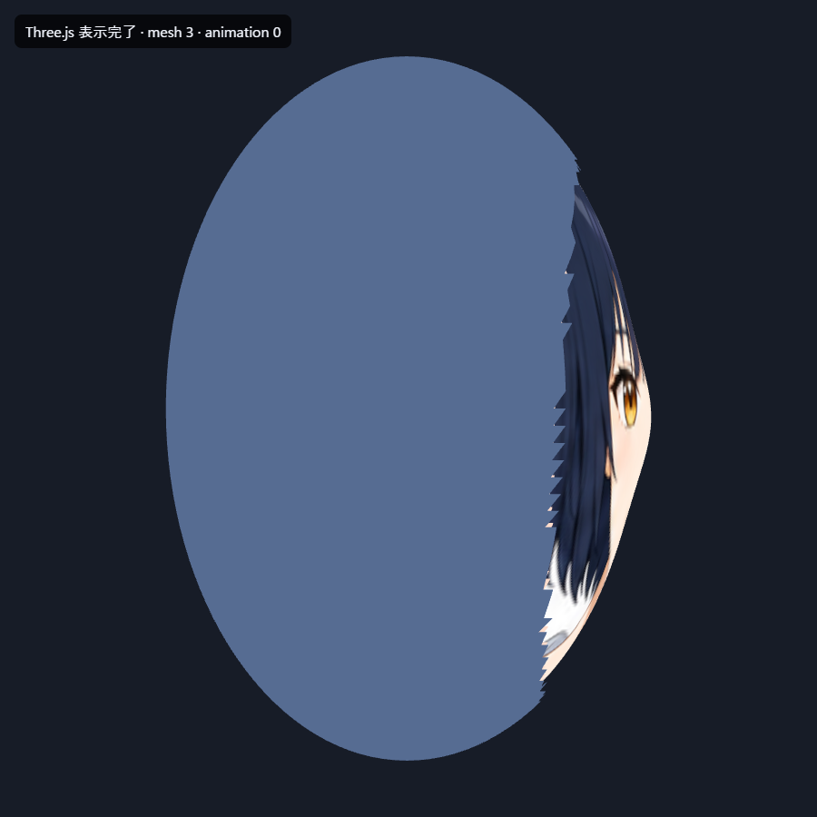

# 顔テンプレート投影の試作結果

3D生成モデルへ目・眉・口の細かな造形を任せず、滑らかな共通頭部へ原画の顔画像を投影する方式の初回試作です。女性キャラクターAを使い、Three.jsで正面、35度、90度を実レンダーしました。

このページは方式を比較するための証拠です。完成品質、採用決定、製品への実装完了を示すものではありません。

## 試作条件

- 滑らかな楕円頭部に、ごく浅い鼻の起伏だけを付けた
- 原画から顔周辺185×195ピクセルを等倍で切り出した
- 補間による引き伸ばし拡大は行っていない
- 顔画像を頭部前面の曲面へ投影した
- 髪と後頭部は形状確認用の簡易シェルであり、完成用モデルではない
- 本体コード、生成パイプライン、採用モデルは変更していない

## 正面

原画の目・眉・口をそのまま認識でき、低品質な3D生成顔より本人性を保てました。ただし、顔画像と簡易頭部の境界、髪形状、元画像自体の顔解像度は未改善です。

## 35度

顔として認識できる範囲です。正面画像を曲面へ投影しているだけなので、奥側の目や輪郭には伸びが出ています。

## 90度

不合格です。正面画像が細く潰れ、横顔の目・鼻・口を構成できません。正面画像1枚だけでは真横を成立させられないことを確認しました。

## 現時点の判定

| 観点 | 判定 | 理由 |
|---|---|---|
| 正面の本人性 | 継続評価 | 原画の顔を直接使うため、生成済み3D顔より改善した |
| 35度 | 継続評価 | 顔として認識できるが、奥側の目と輪郭が伸びる |
| 90度 | 不合格 | 正面画像だけでは横顔の情報が存在しない |
| 頭部・髪の完成度 | 未評価 | 今回は簡易形状であり、完成用テンプレートではない |
| 量産適性 | 未確認 | 自動位置合わせ、境界処理、複数視点の切替をまだ実装していない |

次に比較する場合は、高品質な共通アニメ頭部を使い、原画の正面顔に加えて左右斜め用の顔画像を用意します。顔画像の切替角度、境界の連続性、表情生成後の本人性を実測してから採否を判断します。
